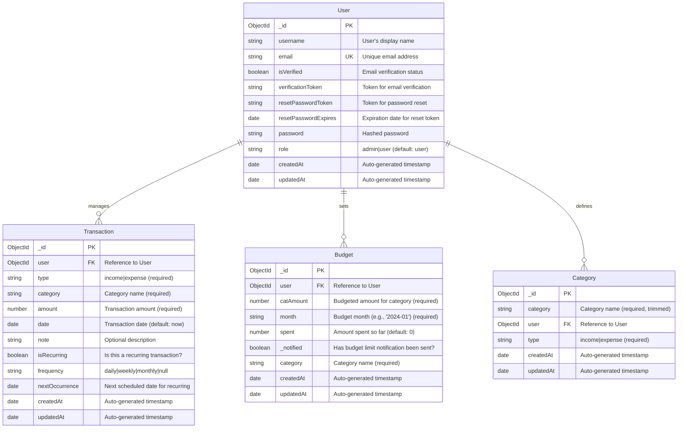

# Entity-Relationship Diagram for Budgetary Project

This ER diagram represents the database schema for the Budgetary personal finance application. It shows the relationships between users and their financial data.

## Key Relationships:

- A User can have multiple Transactions (income/expense records)
- A User can set multiple Budgets for different categories and months
- A User can define multiple Categories for organizing transactions
- Transactions and Budgets reference Categories by name (string), while Categories are user-specific

## Entities and Attributes:

## Notes:

- All entities use MongoDB ObjectId as primary keys
- Timestamps are automatically managed by Mongoose
- Foreign keys are MongoDB references to other documents
- Categories are user-specific and can be either income or expense types
- Transactions can be one-time or recurring with specified frequencies
- Budgets track spending against monthly category limits
